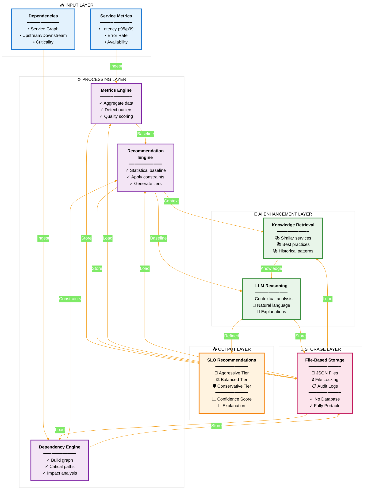
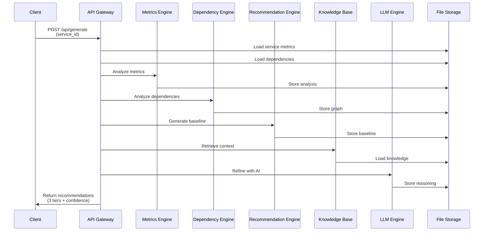
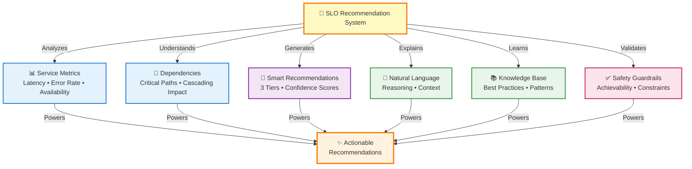
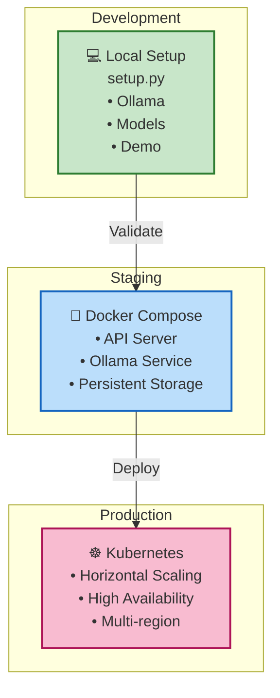

# SLO Recommendation System - Architecture

> A production-ready system for generating AI-assisted SLO recommendations for microservices at scale.

---

## System Overview



---

## Component Responsibilities

| Component | Responsibility | Key Functions |
|-----------|-----------------|----------------|
| **Metrics Engine** | Aggregate and analyze service metrics | • Collect latency, error rate, availability<br/>• Detect statistical outliers<br/>• Generate quality scores |
| **Dependency Engine** | Build and analyze service dependencies | • Construct service graph<br/>• Identify critical paths<br/>• Calculate cascading impact |
| **Recommendation Engine** | Generate baseline SLO recommendations | • Statistical baseline calculation<br/>• Apply infrastructure constraints<br/>• Generate 3 SLO tiers |
| **Knowledge Retrieval** | Provide contextual information | • Find similar services<br/>• Retrieve best practices<br/>• Access historical patterns |
| **LLM Reasoning** | Enhance recommendations with AI | • Contextual analysis<br/>• Natural language explanations<br/>• Confidence scoring |

---

## Request Flow



---

## Key Features



---

## Deployment Architecture



---

## Technology Stack

| Layer | Technology | Purpose |
|-------|-----------|---------|
| **Backend** | Python 3.11+ | Core runtime |
| | FastAPI | REST API framework |
| **Data Processing** | Pandas | Metrics aggregation |
| | NumPy | Statistical analysis |
| | NetworkX | Dependency graph |
| **AI/ML** | Ollama | Local LLM inference |
| | Embeddings | Vector search & similarity |
| **Storage** | JSON Files | Persistent storage (no DB) |
| | File Locking | Concurrent access safety |
| **Deployment** | Docker | Containerization |
| | Kubernetes | Orchestration & scaling |

---

## Performance Characteristics

| Metric | Value | Notes |
|--------|-------|-------|
| **Response Time** | < 3 seconds | Per recommendation |
| **Throughput** | 100+ req/min | Single instance |
| **Scalability** | 100 → 10,000+ services | Linear with K8s |
| **Storage** | ~1 MB per service | JSON-based |
| **Memory** | ~500 MB base | + 100 MB per concurrent request |
| **CPU** | 1-2 cores | Scales horizontally |

---

## Quick Start

### Local Development
```bash
python setup.py
python demo.py
```

### Docker
```bash
docker-compose up
curl http://localhost:8000/api/generate?service_id=api-gateway
```

### Production
```bash
kubectl apply -f k8s/
```

---

## API Reference

### Generate Recommendations
```
POST /api/generate
Query Parameters:
  - service_id: string (required)
  - tenant_id: string (optional)

Response:
{
  "service_id": "api-gateway",
  "recommendations": {
    "aggressive": { "availability": 99.9, "latency_p99": 100 },
    "balanced": { "availability": 99.5, "latency_p99": 150 },
    "conservative": { "availability": 99.0, "latency_p99": 200 }
  },
  "confidence_score": 0.85,
  "explanation": "Based on 30-day metrics and dependency analysis..."
}
```

---

## Data Model

### Service Metrics
```json
{
  "service_id": "api-gateway",
  "timestamp": "2026-03-12T00:00:00Z",
  "metrics": {
    "latency_p95": 45,
    "latency_p99": 120,
    "error_rate": 0.001,
    "availability": 0.9995
  }
}
```

### SLO Recommendation
```json
{
  "service_id": "api-gateway",
  "tier": "balanced",
  "slos": {
    "availability": 99.5,
    "latency_p99": 150,
    "error_rate": 0.01
  },
  "confidence": 0.85,
  "reasoning": "..."
}
```

---

## Architecture Decisions

| Decision | Rationale |
|----------|-----------|
| **File-based Storage** | Simplicity, portability, no DB ops |
| **Local LLM (Ollama)** | Privacy, cost, offline capability |
| **FastAPI** | Performance, async support, auto-docs |
| **NetworkX** | Graph algorithms, dependency analysis |
| **Pandas** | Data manipulation, statistical analysis |

---

## Known Limitations

- Single-instance LLM (Ollama) may timeout on large services
- File-based storage not suitable for 100k+ concurrent requests
- Confidence scores based on heuristics, not ML models
- Regional recommendations removed (POC scope)

---

## Future Enhancements

- [ ] Distributed LLM inference (vLLM, Ray)
- [ ] PostgreSQL backend for production scale
- [ ] ML-based confidence scoring
- [ ] Multi-tenant isolation & RBAC
- [ ] Webhook notifications for SLO changes
- [ ] Historical trend analysis
- [ ] A/B testing framework

